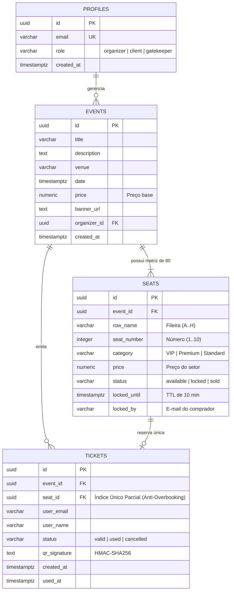

# 🎟️ Elite Tickets — Plataforma de Eventos e Ingressos

Olá! Desenvolvi este projeto para o **Desafio Elite Dev da Verzel**. O objetivo foi construir uma plataforma completa de ponta a ponta: publicação de eventos pelo organizador (integrado a catálogos externos), seleção de assentos em tempo real com bloqueio concorrente no banco de dados, checkout simulado, emissão de bilhetes digitais com QR Code criptografado (HMAC-SHA256) e validação atômica na portaria.

---

## 🔗 Links do Projeto no Ar

- 💻 **Aplicação Web:** [https://elite-tickets.pages.dev](https://elite-tickets.pages.dev)
- ⚙️ **API Serverless:** [https://elite-tickets-api.agenddar.workers.dev](https://elite-tickets-api.agenddar.workers.dev)
- 📦 **Repositório GitHub:** [https://github.com/RafalauriSantos/desafio-elite-dev](https://github.com/RafalauriSantos/desafio-elite-dev)

---

## ⚡ Como Avaliar a Aplicação em 2 Minutos

Para facilitar a sua avaliação sem a necessidade de criar contas do zero, criei um **seletor de personas** no topo da tela:

1. **🎟️ Como Cliente (Comprar e Gerar Ingresso):**
   - Escolha qualquer evento no catálogo e clique em **"Ver assentos"**.
   - Selecione as poltronas no mapa e avance para o pagamento.
   - No modal de checkout, escolha **"Aprovado"** para emitir o ingresso com QR Code (ou teste a opção **"Recusado"** para ver o assento voltar ao estoque no mesmo instante).
2. **🛡️ Como Portaria (Validar Entrada):**
   - Acesse a aba **"Portaria"**.
   - Aponte a câmera para o QR Code emitido (ou use a digitação manual).
   - O sistema valida na hora: `Válido`, `Já Utilizado`, `Inválido` ou `Evento Errado`, com retorno tátil de vibração no celular.
3. **🎪 Como Organizador (Publicar e Importar):**
   - Mude a persona para **"Organizador"**.
   - Clique em **"Publicar evento"** para cadastrar manualmente ou importar atrações direto da API do **TMDb** / catálogo curado.

---

## 👥 Usuários Semeados para Teste (Seed Data)

Se você preferir testar via tela de login tradicional, os seguintes usuários já estão pré-configurados:

| Papel | E-mail de Teste | Permissões |
| :--- | :--- | :--- |
| **Organizador** | `organizador@verzel.com` | Publicar eventos e importar do TMDb |
| **Cliente 1** | `ana.cliente@verzel.com` | Navegar, reservar assentos e comprar |
| **Cliente 2** | `bruno.cliente@verzel.com` | Navegar, reservar assentos e comprar |
| **Portaria** | `portaria@verzel.com` | Validar ingressos na câmera/manual |

---

## 🧠 Minhas Decisões Técnicas de Engenharia

- **Por que escolhi Cloudflare Workers + Hono.js no Back-End?**  
  Busquei uma arquitetura Serverless executando direto na borda (*Edge*), com latência inferior a 50ms e deploy global sem custos de infraestrutura ociosa. O Hono.js me deu velocidade, tipagem estrita e compatibilidade nativa com Web Standards.

- **Como resolvi a Concorrência no Banco de Dados?**  
  Em vez de tentar controlar concorrência na memória do servidor (o que falha em ambientes distribuídos e serverless), preferi resolver na raiz: criei uma Stored Procedure no PostgreSQL com `SELECT ... FOR UPDATE ORDER BY id ASC`. Isso garante que, mesmo com requisições simultâneas concorrendo pelo mesmo assento, apenas uma vença e as outras sejam rejeitadas sem risco de deadlocks.

- **Por que usei HMAC-SHA256 no QR Code?**  
  Para que o ingresso seja infalsificável. O QR Code não guarda apenas um ID de texto puro; ele carrega uma assinatura criptográfica gerada na borda com uma chave secreta do servidor, impedindo que qualquer pessoa forje ingressos apenas clonando o payload JSON.

- **Por que optei pelo Design Minimalista Suíço (Swiss Design)?**  
  Fugi conscientemente de interfaces poluídas com excesso de sombras e gradientes roxos genéricos (*AI Slop*). Desenhei um passe digital limpo, no padrão Apple Wallet, focado no que realmente importa na hora do evento: contraste alto para leitura rápida na portaria e um layout rigorosamente alinhado para impressão e download em PDF A4.

- **Envio Real de E-mails com Resend:**  
  Integrei o envio de e-mails em segundo plano no Worker (`c.executionCtx.waitUntil(sendTicketEmail(...))`). Dessa forma, o e-mail real com o bilhete é despachado sem travar nem acrescentar milissegundos à resposta do checkout na tela.

---

## 🗄️ Banco de Dados & Arquitetura de Concorrência

O projeto utiliza **PostgreSQL** hospedado no Supabase, projetado com **Defesa em Profundidade em 2 Camadas** para garantir integridade transacional absoluta e zero overbooking. Toda a estrutura e Stored Procedures estão versionadas no arquivo [`supabase/schema.sql`](supabase/schema.sql).

### 📊 Diagrama Entidade-Relacionamento (ERD)



### 🛡️ Pilares de Segurança & Integridade de Dados:
1. **Pessimistic Locking (`SELECT ... FOR UPDATE`):** Na Stored Procedure `reserve_ticket_atomic`, as poltronas são bloqueadas no nível de linha, serializando requisições simultâneas e evitando *race conditions*.
2. **Prevenção de Deadlocks (`ORDER BY 1 ASC`):** Na reserva em lote (`reserve_tickets_batch_atomic`), os IDs dos assentos são ordenados de forma determinística antes de adquirir as travas.
3. **Anti-Overbooking no Nível de DDL (Índice Único Parcial):**
   ```sql
   CREATE UNIQUE INDEX idx_unique_active_ticket_seat 
   ON public.tickets (seat_id) 
   WHERE status IN ('valid', 'used');
   ```
   *Garante matematicamente que, mesmo se houver um `INSERT` direto no banco, nunca existirão dois ingressos ativos para o mesmo assento.*
4. **Validação Atômica na Portaria:** A Stored Procedure `validate_ticket_gatekeeper` processa atomicamente a máquina de 4 estados (`VALID`, `ALREADY_USED`, `INVALID`, `WRONG_EVENT`).
5. **Row Level Security (RLS) Default Deny:** Nenhuma alteração de escrita pode ser feita diretamente via API pública; todas as mutações passam pelas Stored Procedures com `SECURITY DEFINER`.

---

## 🛠️ Stack que Utilizei

- **Front-End:** React, Vite, TypeScript, Tailwind CSS, Lucide Icons, `qrcode.react`, `html5-qrcode`.
- **Back-End:** TypeScript, Hono.js, Cloudflare Workers Runtime, Web Crypto API.
- **Banco de Dados:** PostgreSQL (Supabase) com Stored Procedures em PL/pgSQL e Row Level Security (RLS).
- **Testes & CI/CD:** Vitest, Playwright (E2E), Gitleaks e GitHub Actions com deploy automático.

---

## 🚀 Como Executar Localmente

### 1. Clonar e Instalar
```bash
git clone https://github.com/RafalauriSantos/desafio-elite-dev.git
cd desafio-elite-dev
npm install
```

### 2. Rodar a Aplicação
```bash
# Iniciar o Front-End
cd client && npm run dev

# Iniciar a API Localmente
cd server && npm run dev
```

### 3. Rodar a Suíte de Testes
```bash
npm run typecheck    # Verificação estrita de TypeScript
npm run test         # Testes unitários (Client + Server)
npm run test:e2e     # Testes de integração E2E com Playwright
```

---

## 📚 Documentação Adicional

- 📜 **Enunciado Original da Verzel:** [`docs/DESAFIO_ELITE_DEV_EDITAL.md`](docs/DESAFIO_ELITE_DEV_EDITAL.md)
- 📋 **Checklist de Itens Entregues:** [`docs/CHECKLIST_ENTREGA.md`](docs/CHECKLIST_ENTREGA.md)
- 🤖 **Transparência no Uso de IA:** [`docs/AI_LOG.md`](docs/AI_LOG.md)
- 🧭 **Grafo de Arquitetura (Graphify):** [`graphify-out/GRAPH_REPORT.md`](graphify-out/GRAPH_REPORT.md)
