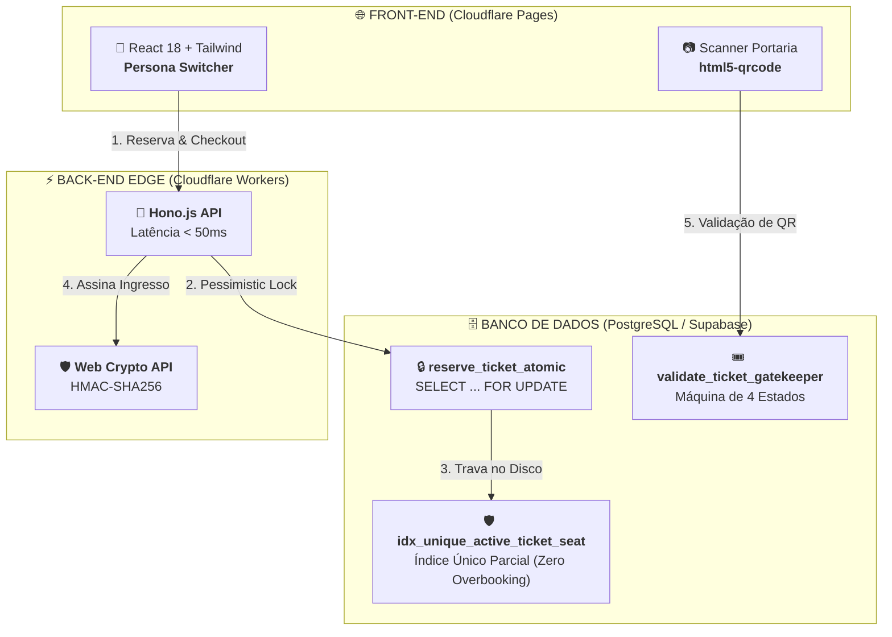

# 🎟️ Elite Tickets — Plataforma de Eventos e Ingressos

Plataforma de ponta a ponta para publicação de eventos, seleção de assentos com controle de concorrência no PostgreSQL, checkout simulado, emissão de bilhetes com QR Code assinado via HMAC-SHA256 e validação atômica na portaria. Desenvolvido para o **Desafio Elite Dev (Verzel)**.

---

## 🔗 Links em Produção

- 💻 **Aplicação Web:** [https://elite-tickets.pages.dev](https://elite-tickets.pages.dev)
- ⚙️ **API Serverless:** [https://elite-tickets-api.agenddar.workers.dev](https://elite-tickets-api.agenddar.workers.dev)
- 📦 **Repositório:** [https://github.com/RafalauriSantos/desafio-elite-dev](https://github.com/RafalauriSantos/desafio-elite-dev)

---

## ⚡ Guia Rápido de Avaliação (3 Personas)

O seletor de personas no topo da tela permite testar todos os fluxos sem necessidade de cadastro:

1. **🎟️ Cliente (Reserva e Compra):**
   - Acesse qualquer evento $\rightarrow$ selecione os assentos no mapa interativo.
   - Avance para o checkout $\rightarrow$ selecione **"Aprovado"** para emitir o ingresso (ou **"Recusado"** para testar o retorno imediato do assento ao estoque).
2. **🛡️ Portaria (Validação de Acesso):**
   - Acesse a aba **"Portaria"** $\rightarrow$ aponte a câmera para o QR Code ou use a digitação manual.
   - Valida na hora os 4 estados: `Válido`, `Já Utilizado`, `Inválido` ou `Evento Errado`.
3. **🎪 Organizador (Gestão e Catálogo):**
   - Mude para a persona **"Organizador"** $\rightarrow$ clique em **"Publicar evento"**.
   - Cadastre manualmente ou importe atrações em lote via catálogo **TMDb / Ticketmaster**.

### Usuários Pré-Configurados (Seed Data)
| Papel | E-mail | Permissões |
| :--- | :--- | :--- |
| **Organizador** | `organizador@verzel.com` | Publicação e importação de eventos |
| **Cliente 1** | `ana.cliente@verzel.com` | Reserva e compra de ingressos |
| **Cliente 2** | `bruno.cliente@verzel.com` | Reserva e compra de ingressos |
| **Portaria** | `portaria@verzel.com` | Validação de entradas na portaria |

---

## 🏗️ Arquitetura & Decisões Técnicas

- **Concorrência no PostgreSQL:** Stored Procedure `reserve_ticket_atomic` com `SELECT ... FOR UPDATE` para serializar requisições concorrentes. Na reserva em lote, ordenação determinística (`ORDER BY 1 ASC`) para prevenir deadlocks.
- **Anti-Overbooking no DDL:** Índice único parcial `CREATE UNIQUE INDEX idx_unique_active_ticket_seat ON tickets (seat_id) WHERE status IN ('valid', 'used')` que impede duplicação no nível de disco.
- **Back-End Serverless (Hono.js + Cloudflare Workers):** Execução em V8 Isolates distribuídos globalmente com latência sub-50ms e zero cold start.
- **Criptografia HMAC-SHA256:** Assinatura digital do payload via Web Crypto API nativa. A chave secreta reside exclusivamente no Worker.
- **Despacho Assíncrono de E-mails:** Integração com Resend via `c.executionCtx.waitUntil()`, enviando e-mails reais em background sem atrasar o retorno do checkout.
- **Zero Any no TypeScript:** 100% do código (Client e Server) tipado com interfaces estritas.

---

## 🏗️ Arquitetura do Sistema (Visão Geral)

Toda a infraestrutura do projeto opera em arquitetura desacoplada e distribuída na borda:



---

## 🛠️ Stack Tecnológica

- **Front-End:** React 18, Vite, TypeScript, Tailwind CSS, Lucide Icons, `qrcode.react`, `html5-qrcode`.
- **Back-End:** Hono.js, Cloudflare Workers Runtime, Web Crypto API, Resend SDK.
- **Banco de Dados:** PostgreSQL (Supabase), PL/pgSQL Stored Procedures, Row Level Security (RLS).
- **Testes & CI/CD:** Vitest (Unitários), Playwright (E2E), Gitleaks (Secret Scan), GitHub Actions.

---

## 🚀 Execução Local

```bash
# 1. Clonar o repositório
git clone https://github.com/RafalauriSantos/desafio-elite-dev.git
cd desafio-elite-dev

# 2. Instalar dependências
npm install

# 3. Executar em modo de desenvolvimento
npm run dev --prefix client   # Front-End (http://localhost:5173)
npm run dev --prefix server   # API Local (http://localhost:8787)

# 4. Executar suíte de testes e validação
npm run typecheck             # TypeScript estrito (Client + Server)
npm test                      # Testes unitários Vitest (Client + Server)
node tests/qa_all_scenarios_suite.mjs  # Suíte de 18 cenários de concorrência e segurança
```

---

## 📚 Documentação do Projeto

- 📋 **Checklist de Requisitos do Edital:** [`docs/CHECKLIST_ENTREGA.md`](docs/CHECKLIST_ENTREGA.md)
- 📜 **Edital Original da Verzel:** [`docs/DESAFIO_ELITE_DEV_EDITAL.md`](docs/DESAFIO_ELITE_DEV_EDITAL.md)
- 🤖 **Registro de IA e Arquitetura:** [`docs/AI_LOG.md`](docs/AI_LOG.md)
- 🧭 **Grafo de Arquitetura do Sistema:** [`graphify-out/GRAPH_REPORT.md`](graphify-out/GRAPH_REPORT.md)
