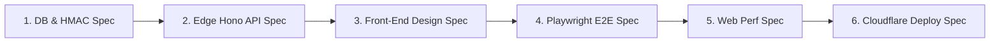

# 📐 Metodologia Spec-Driven Development (SDD) & Arquitetura

**Projeto:** Plataforma de Eventos e Ingressos — Desafio Elite Dev 2026 (Verzel)  
**Abordagem:** Spec-Driven Development (SDD) + Domain-Driven Architecture  

---

## 🎯 Por que Spec-Driven Development (SDD)?

O **Spec-Driven Development (SDD)** é uma metodologia de engenharia onde **especificações formais, contratos criptográficos e regras de domínio precedem a escrita do código de implementação**.

No contexto do Desafio Elite Dev da Verzel, o SDD garante:
1. **Zero Bugs de Concorrência:** A especificação da trava pessimista no Postgres (`SELECT ... FOR UPDATE`) é contratualmente validada antes da interface gráfica.
2. **Infalsificabilidade de QR Codes:** A assinatura HMAC-SHA256 via Web Crypto API é especificada como requisito rígido de borda.
3. **Imunidade a AI Slop:** A especificação do Design System proíbe componentes aleatórios ou despadronizados.

---

## 🗺️ As 6 Fases da Especificação (Spec Pipeline)

---

### 📋 Especificação Detalhada por Fase

### 1. Especificação de Domínio, Banco & Criptografia (DB & Security Spec)
- **Tabelas PostgreSQL:** `events`, `seats`, `tickets`, `gatekeeper_logs`.
- **Procedimento Atômico:** `reserve_ticket_atomic` com `SELECT ... FOR UPDATE` executado em nível de banco via Stored Procedure PL/pgSQL no Supabase.
- **Assinatura HMAC:** Payload de QR Code assinado via HMAC-SHA256 com verificação em tempo constante (`crypto.subtle.verify`).
- **Estados da Portaria:** Tratamento atômico de `VALID`, `ALREADY_USED`, `INVALID` e `WRONG_EVENT`.

### 2. Especificação de Back-End Serverless (Edge API Spec)
- **Servidor:** Node.js / TypeScript com **Hono.js** para deploy no **Cloudflare Workers**.
- **Endpoints Expostos:**
  - `GET /api/events` (Catálogo público).
  - `GET /api/external-catalog` (Integração TMDb / Ticketmaster).
  - `POST /api/tickets/reserve` (Reserva atômica).
  - `POST /api/gatekeeper/validate` (Validação de acesso na portaria).
- **Proteção:** Limitador de requisições na borda (*Rate Limiting*) e sanitização de dados.

### 3. Especificação de UI/UX (Front-End Design Spec)
- **Design System:** Dark Minimalist de luxo (`#09090b` / `#121215`).
- **Fluxo do Organizador:** Modal em 2 etapas (Busca TMDb/Ticketmaster -> Configuração de Data/Arena/Preço/Capacidade).
- **Mapa de Assentos:** Layout de arena com curva visual de tela e status em tempo real.
- **Canhoto do Ingressos:** Design estilo bilhete físico (`ticket-stub`) com recortes circulares laterais.
- **Portaria:** Leitura via câmera do dispositivo (`html5-qrcode`) e entrada manual para contingência.

### 4. Especificação de Testes Automatizados (Playwright E2E Spec)
- **Tooling:** Automação com Playwright (skill `webapp-testing`).
- **Cenário Principal:**
  1. Organizador cria novo evento.
  2. Cliente seleciona assento e conclui checkout simulado.
  3. Sistema gera QR Code assinado.
  4. Portaria lê QR Code e valida acesso em 1ª tentativa (`VALID`).
  5. Portaria relê o mesmo QR Code e rejeita em 2ª tentativa (`ALREADY_USED`).

### 5. Especificação de Performance (Web Perf Spec)
- **Core Web Vitals:** LCP <= 1.2s, INP <= 100ms, CLS = 0.0 via Skeleton Loaders.

### 6. Especificação de Deploy (Cloudflare & Supabase Spec)
- **Front-End:** Deploy em Cloudflare Pages.
- **Back-End:** Deploy em Cloudflare Workers.
- **Banco de Dados:** Supabase Production Cluster com RLS ativado.
