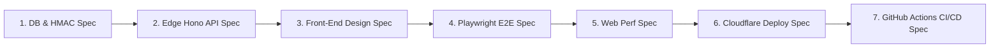

# 📐 Metodologia Spec-Driven Development (SDD) & Arquitetura

**Projeto:** Plataforma de Eventos e Ingressos — Desafio Elite Dev 2026 (Verzel)  
**Abordagem:** Spec-Driven Development (SDD) + Domain-Driven Architecture  

---

## 🎯 Por que Spec-Driven Development (SDD)?

O **Spec-Driven Development (SDD)** é uma metodologia de engenharia onde **especificações formais, contratos criptográficos e regras de domínio precedem a escrita do código de implementação**.

No contexto do Desafio Elite Dev da Verzel, o SDD garante:
1. **Zero Bugs de Concorrência & Deadlocks:** A especificação da trava pessimista no Postgres (`SELECT ... FOR UPDATE ORDER BY id ASC`) é contratualmente validada antes da interface gráfica.
2. **Infalsificabilidade de QR Codes & Formato Apple Wallet Pass:** A assinatura HMAC-SHA256 via Web Crypto API é especificada como requisito rígido de borda e renderizada em passes verticais `100mm x 160mm`.
3. **Imunidade a AI Slop:** A especificação do Design System proíbe componentes aleatórios ou despadronizados, aplicando Bottom Sheets nativas com safe area no iOS.

---

## 🗺️ As 7 Fases da Especificação (Spec Pipeline)

---

### 📋 Especificação Detalhada por Fase

### 1. Especificação de Domínio, Banco & Criptografia (DB & Security Spec)
- **Tabelas PostgreSQL:** `events`, `seats`, `tickets`, `gatekeeper_logs`.
- **Procedimento Atômico de Lote:** `reserve_tickets_batch_atomic` com `SELECT ... FOR UPDATE ORDER BY id ASC` no PostgreSQL (Supabase) evitando deadlocks sob requisições concorrentes.
- **Assinatura HMAC:** Payload de QR Code assinado via HMAC-SHA256 com verificação em tempo constante (`crypto.subtle.verify`) e máscaras `REF: #7361-5E6D`.
- **Estados da Portaria:** Tratamento atômico de `VALID` (com vibração háptica `[80ms]`), `ALREADY_USED` (`[100ms, 50ms, 100ms]`), `INVALID` e `WRONG_EVENT`.

### 2. Especificação de Back-End Serverless (Edge API Spec)
- **Servidor:** Node.js / TypeScript com **Hono.js** para deploy no **Cloudflare Workers** (`elite-tickets-api`).
- **Endpoints Expostos:**
  - `GET /api/events` (Catálogo público).
  - `GET /api/external-catalog` (Integração 24 atrações TMDb / Ticketmaster).
  - `POST /api/reserve-batch` (Reserva atômica em lote).
  - `POST /api/events/bulk-import` (Importação em lote de atrações externas).
  - `POST /api/checkout` (Emissão de e-tickets assinados).
  - `POST /api/gatekeeper/validate` (Validação de acesso na portaria).

### 3. Especificação de UI/UX (Front-End Design Spec)
- **Design System:** Dark Minimalist de luxo (`#09090b` / `#121215`).
- **Layout Unificado:** `Layout.tsx` como contêiner único da altura vertical (`min-h-screen flex flex-col flex-1`).
- **Modal & Bottom Sheet:** Modais convertidos para Bottom Sheet em telas pequenas com `padding-bottom: env(safe-area-inset-bottom)`.
- **Mapa de Assentos:** Seleção múltipla de poltronas com destaque de letras de fileira (A, B, C, D) e cálculo de total acumulado.
- **Passe Eletrônico:** Design estilo **Apple Wallet Pass** (`100mm x 160mm`) com QR Code em vetor e badge de verificação.

### 4. Especificação de Testes Automatizados (Playwright E2E & Vitest Spec)
- **Tooling:** Vitest + React Testing Library (unidade) e Playwright Headless (integração E2E).
- **Cenário E2E Completo:**
  1. Organizador visualiza e abre modal de publicação.
  2. Cliente seleciona múltiplos assentos e conclui checkout.
  3. Sistema gera QR Code assinado em formato Apple Wallet.
  4. Portaria lê QR Code com feedback háptico e valida estado.

### 5. Especificação de Performance (Web Perf Spec)
- **Core Web Vitals:** LCP <= 1.2s, INP <= 100ms, CLS = 0.0 via Skeleton Loaders e background polling silencioso de assentos a cada 3s.

### 6. Especificação de Deploy Cloudflare & Supabase
- **Front-End:** Deploy na Cloudflare Pages (`https://elite-tickets.pages.dev`).
- **Back-End:** Deploy na Cloudflare Workers (`https://elite-tickets-api.agenddar.workers.dev`).
- **Banco de Dados:** Supabase PostgreSQL com RLS e Stored Procedures.

### 7. Especificação da Esteira CI/CD (GitHub Actions Spec)
- **Pipeline:** `.github/workflows/ci-cd.yml` com 4 jobs encadeados:
  1. `security-audit`: Gitleaks + `.gitleaks.toml` allowlist.
  2. `type-check`: TypeScript (`tsc --noEmit`).
  3. `test-suite`: Vitest unit tests + Playwright E2E.
  4. `deploy-production`: Deploy automático na Cloudflare após aprovação.
